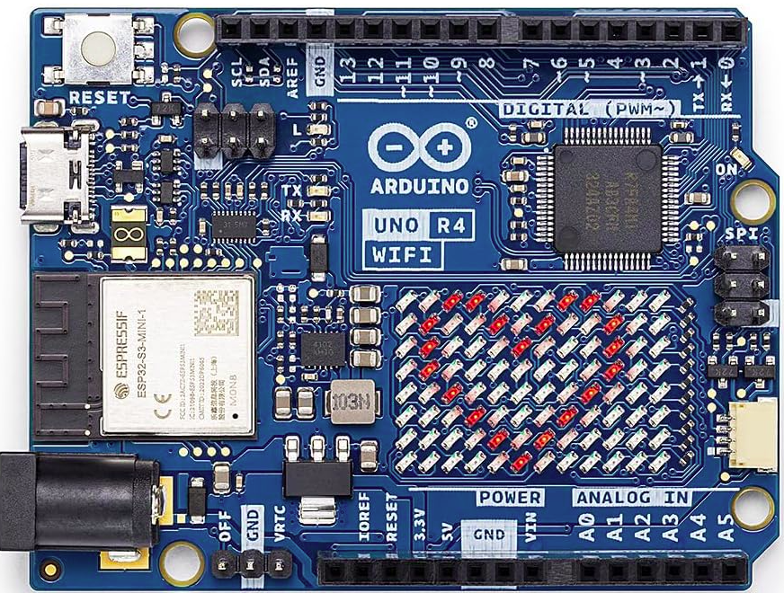
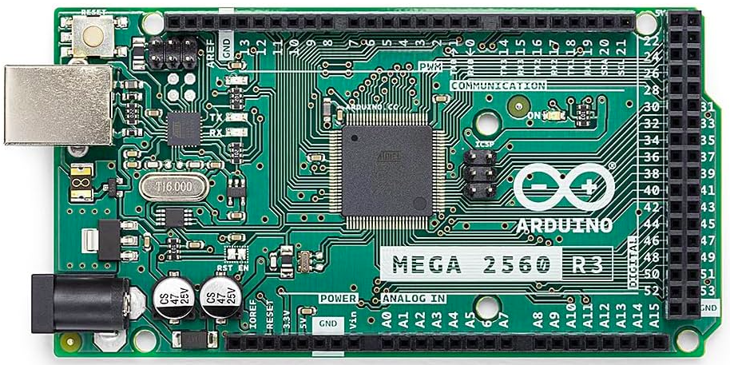
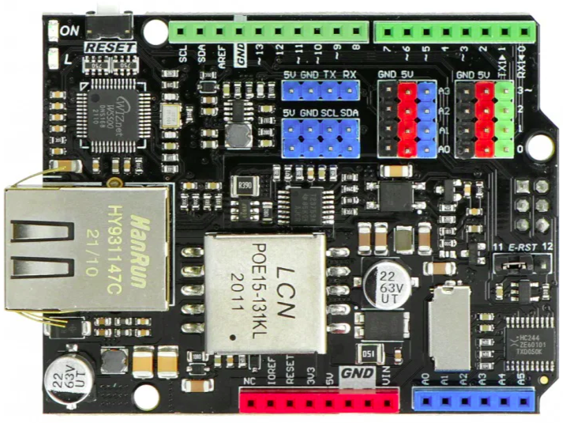

# ArduLearn

PLC didattico per la scuola: si programma dal browser in **FBD** (blocchi collegati con i fili),
**LADDER** (stile TIA Portal) o **GRAFCET/SFC** con segmenti LADDER, e gira su Arduino.
Stati in tempo reale, simulatore nella pagina, PIN docente, più studenti collegati insieme,
display OLED/LCD facoltativi, moduli per sensori e attuatori, blocchi Script ST e Script C.

*Ideato e realizzato da Daniele Michelotti.*

## Scarica

**[ArduLearn.exe](https://github.com/danielemichelotti/ArduLearn/releases/latest/download/ArduLearn.exe)** —
app per Windows: trova la scheda collegata via USB e ci installa ArduLearn (Mega 2560 o UNO R4 WiFi).
Tutte le versioni sono nelle [Release](https://github.com/danielemichelotti/ArduLearn/releases).
Presentazione: [brochure (PDF)](docs/ArduLearn_brochure.pdf) · [manuale del docente (PDF)](docs/ArduLearn_manuale_docente.pdf).
Tutto insieme (app, brochure e manuale): **[ArduLearn.zip](https://github.com/danielemichelotti/ArduLearn/releases/latest/download/ArduLearn.zip)**.

## Schede

<p>
  
  
  
</p>

| Scheda | Stato | Rete | Memoria programmi |
|---|---|---|---|
| **Arduino Mega 2560** + shield DFRobot [Ethernet & PoE DFR0850](https://www.dfrobot.com/product-2370.html) (W5500) | completo | Ethernet (DHCP o indirizzo automatico 169.254.x.y), PoE | microSD della shield (slot 1–99, bozza condivisa) + copia in EEPROM |
| **Arduino UNO R4 WiFi** (senza shield) | completo | Wi-Fi integrato (rete della scuola o rete propria "ArduLearn-xxxx" con portale), nome `.local` | programma attivo nel RA4M1; slot 1–99 e bozza nella flash del modulo Wi-Fi |

Sulla UNO R4 WiFi il modulo ESP32-S3 ha un firmware proprio, **ArduLearnBridge** (al posto del
"USB bridge" di Arduino, di cui tiene la parte USB: caricamento degli sketch dall'IDE, aggiornamento
e ripristino del firmware originale da Strumenti → Aggiornamento firmware). Fa da server web (pagina,
Wi-Fi, slot, bozza, aggiornamenti) e passa le richieste per il PLC al RA4M1 su un collegamento seriale
a 1 Mbaud. Dalla pagina si aggiornano PLC, pagina e modulo Wi-Fi anche da Internet (cartella
`aggiornamenti/`); la matrice LED si usa dai programmi (blocchi immagine e testo).

Non supportate: Arduino Uno classico e DFR0342 (memoria insufficiente), UNO R4 Minima (per ora).

## Struttura

```
PlcBlocchi/        firmware (un solo sorgente, si compila per Mega e UNO R4 WiFi)
  config.h         scheda, pin, limiti, funzioni presenti (HAS_*)
  engine.*         interprete dei blocchi (ciclo PLC)
  script.*         macchina virtuale per Script ST e Script C
  web.*            server HTTP e API (/api/...)
  storage.*        EEPROM, microSD, slot
  net.h, bridge.cpp  rete: Ethernet (Mega) o collegamento col modulo Wi-Fi (UNO R4 WiFi)
  displays.*, textoled.*, charlcd.*, ledmatrix.*   display e matrice LED
  mod_*.cpp        moduli (buzzer, DHT, DS18B20, HC-SR04, encoder, servo, stepper, WS2812, RTC)
  web_page.h       pagina web compressa (GENERATO da tools/build_web.py)
web/index.html     editor (pagina unica); web/modules.js e' generato dai moduli
ArduLearnBridge/   firmware del modulo Wi-Fi ESP32-S3 della UNO R4 WiFi (core esp32 di Arduino)
  link.*           collegamento col RA4M1 (link_proto.h, uguale in PlcBlocchi/)
  web.*, wifimgr.*, ota.*   server web, Wi-Fi, aggiornamenti; src/bossa: scrittura del RA4M1
tools/build_web.py genera web_page.h, modules.js, modules_registry.cpp e la pagina per microSD ed ESP32
tools/prepara_aggiornamento.py   prepara aggiornamenti/ (manifest.json e firmware per la pagina)
aggiornamenti/     ultima versione per la UNO R4 WiFi, letta dalla pagina su raw.githubusercontent.com
tools/app/         app Windows ArduLearn.exe (trova le schede, carica il firmware, monitor seriale)
img/               logo (pagina, OLED, icona dell'app) e foto delle schede
docs/              brochure di presentazione e manuale del docente (PDF)
```

## Compilare

Requisiti: [Arduino CLI](https://arduino.github.io/arduino-cli/), core `arduino:avr`, `arduino:renesas_uno` ed `esp32:esp32`,
librerie Ethernet, SD, ArduinoMDNS, Adafruit NeoPixel, Servo; Python 3; facoltativi Node.js (per minificare la pagina)
e `pip install zopfli` (compressione migliore).

```bash
cd tools && npm install          # una volta: minificatore della pagina (terser)
python tools/build_web.py        # dopo ogni modifica a web/index.html o ai moduli
arduino-cli compile -b arduino:avr:mega PlcBlocchi
arduino-cli compile -b arduino:renesas_uno:unor4wifi PlcBlocchi
arduino-cli compile -b "esp32:esp32:esp32s3:USBMode=default,CDCOnBoot=default,FlashSize=4M" ArduLearnBridge
```

Prova della pagina senza scheda: `python -m http.server 8765 --directory web` e apri
`http://localhost:8765/index.html?demo` (simulatore; `?demo&r4` simula l'UNO R4 WiFi).

L'app per Windows: `python tools/app/prepara_firmware.py` (compila e copia i firmware) e poi
`tools/app/build.bat` (PyInstaller); vedi `tools/app/README.md`. Una nuova versione per le UNO R4
WiFi si pubblica con `python tools/prepara_aggiornamento.py "nota"` e commit/push della cartella
`aggiornamenti/` sul ramo `main` (le versioni sono FW_VERSION in config.h e BRIDGE_FW_VERSION in
ArduLearnBridge/bridge_config.h).

## Licenza

GPL-3.0: vedi [LICENSE](LICENSE).
